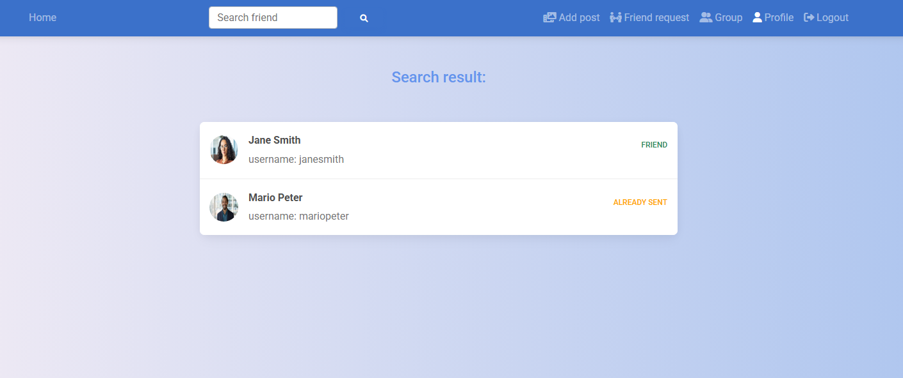
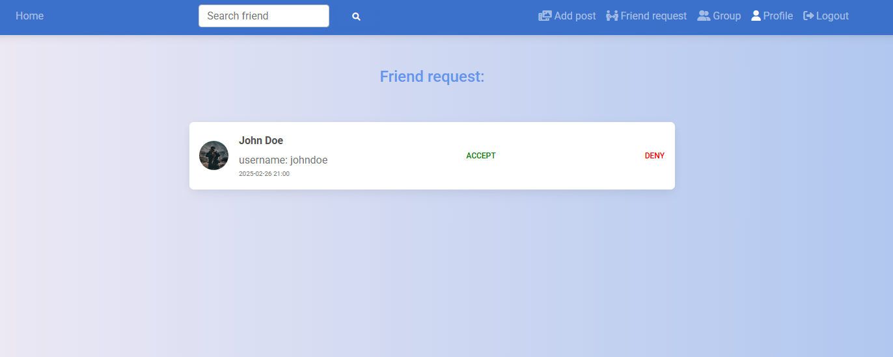
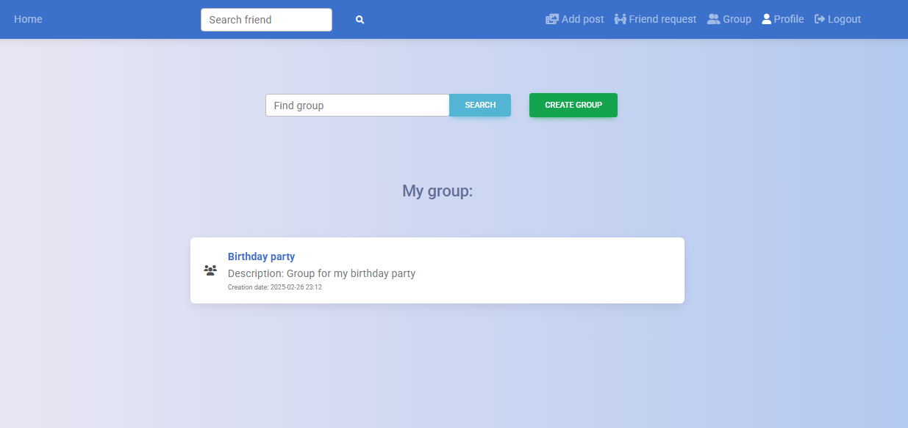

# Social network
Connectify is a vibrant social network application designed to help users connect, share, and discover content from friends and communities. With a focus on user-generated content and community engagement, Connectify provides a personalized social experience. Users can create profiles, post updates, share photos, and interact with others through comments and likes, all in an environment that values privacy and user control.

## Tech Stack
- **Frontend**: HTML, CSS, TypeScript, Angular, Node.js
- **Backend**: Java, Spring Boot
- **Database**: MySQL
- **Authentication**: JWT
- **Authorization**: RBAC

## Installation and Setup
To run this project locally, follow these steps:

1. Clone the repository:
   git clone repository-url.

2. Set up the database:
Create a new database in MySQL using: create database socialnetwork.
Set up datasource url to socialnetwork database and other parameters in application.properties.

4. Run the backend application:
Navigate to the backend directory and run: mvn spring-boot:run.
   
5. Run the frontend application:
Navigate to the frontend directory and run: npm install then ng serve --proxy-config proxy.conf.json.

Open the project at: http://localhost:4200

